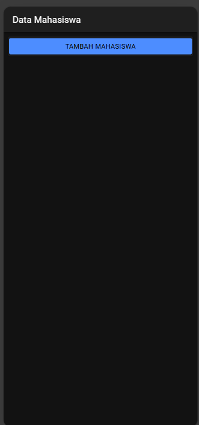
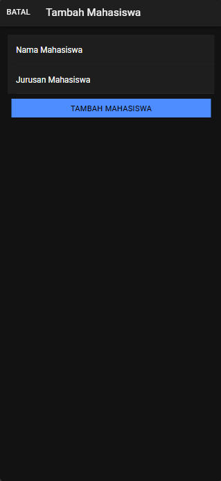
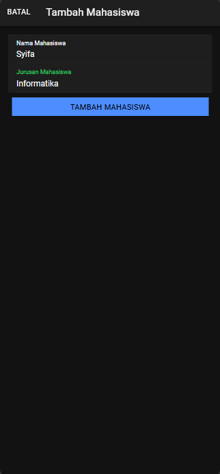
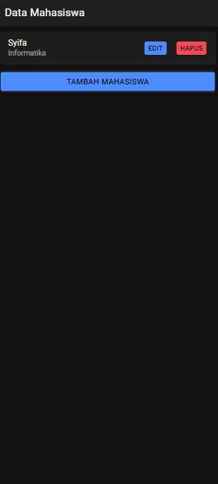
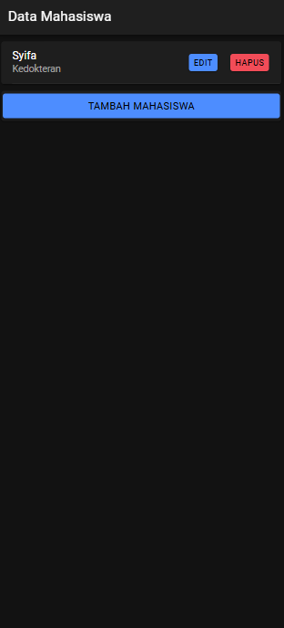
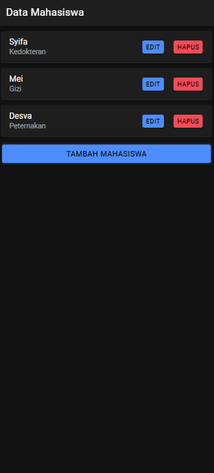

# Penjelasan CRUD

## Read
getMahasiswa() {
  this.api.tampil('tampil.php').subscribe({
    next: (res: any) => {
      this.dataMahasiswa = res.filter((item: any) => 
        item && item.nama && item.jurusan && 
        item.nama.trim() !== '' && item.jurusan.trim() !== ''
      );
    },
    error: (err: any) => {
      // Error handling
    },
  });
}
- Header dengan icon person dan judul "Data Mahasiswa"
- Mengimplementasikan ionicon pada create update delete agar tampilan lebih menarik
- Daftar mahasiswa dalam format card
- Tombol aksi (edit & hapus) untuk setiap data
- Menggunakan metode GET dengan endpoint 'tampil.php'
## Tampilan 

## Create
async tambahMahasiswa() {
  if (this.namaMahasiswa != '' && this.jurusan != '') {
    let data = {
      nama: this.namaMahasiswa,
      jurusan: this.jurusan,
    }
    // Proses pengiriman data ke server
  }
}

- Implementasi ion-modal dengan template terstruktur
- Form input dengan validasi
- Tombol close dan submit
- Menggunakan metode POST dengan endpoint 'tambah.php'

## Tampilan Create

## Edit 
ambilMahasiswa(id: any) {
  this.api.lihat(id, 'lihat.php?id=').subscribe({
    next: (hasil: any) => {
      let mahasiswa = hasil;
      this.id = mahasiswa.id;
      this.namaMahasiswa = mahasiswa.nama;
      this.jurusan = mahasiswa.jurusan;
    },
    error: (error: any) => {
      console.log('gagal ambil data');
    }
  })
}
- Data mahasiswa yang akan diedit akan terisi otomatis di form
- Menggunakan metode PUT dengan endpoint 'edit.php'
- Menggunakan fungsi ambilMahasiswa() untuk mengambil data dari server
- Field nama dan jurusan akan langsung terisi dengan data yang sudah ada

## Tampilan Edit

## Delete
async konfirmasiHapus(id: any) {
  const alert = await this.alertController.create({
    header: 'Konfirmasi',
    message: 'Apakah anda yakin ingin menghapus data ini?',
    buttons: [
      {
        text: 'Tidak',
        role: 'cancel'
      }, {
        text: 'Ya',
        handler: () => {
          this.hapusMahasiswa(id);
        }
      }
    ]
  });
}
- Dialog konfirmasi dua langkah (Ya/Tidak)
- Mencegah penghapusan tidak sengaja
- Menggunakan metode DELETE dengan endpoint 'hapus.php'
- Refresh otomatis daftar mahasiswa setelah penghapusan
- Memastikan data yang ditampilkan selalu yang terbaru
hapusMahasiswa(id: any) {
  this.api.hapus(id, 'hapus.php?id=').subscribe({
    next: (res: any) => {
      console.log('sukses', res);
      this.getMahasiswa(); // Refresh data setelah hapus
      console.log('berhasil hapus data');
    },
    error: (error: any) => {
      console.log('gagal');
    }
  })
}

## Tampilan Delete

